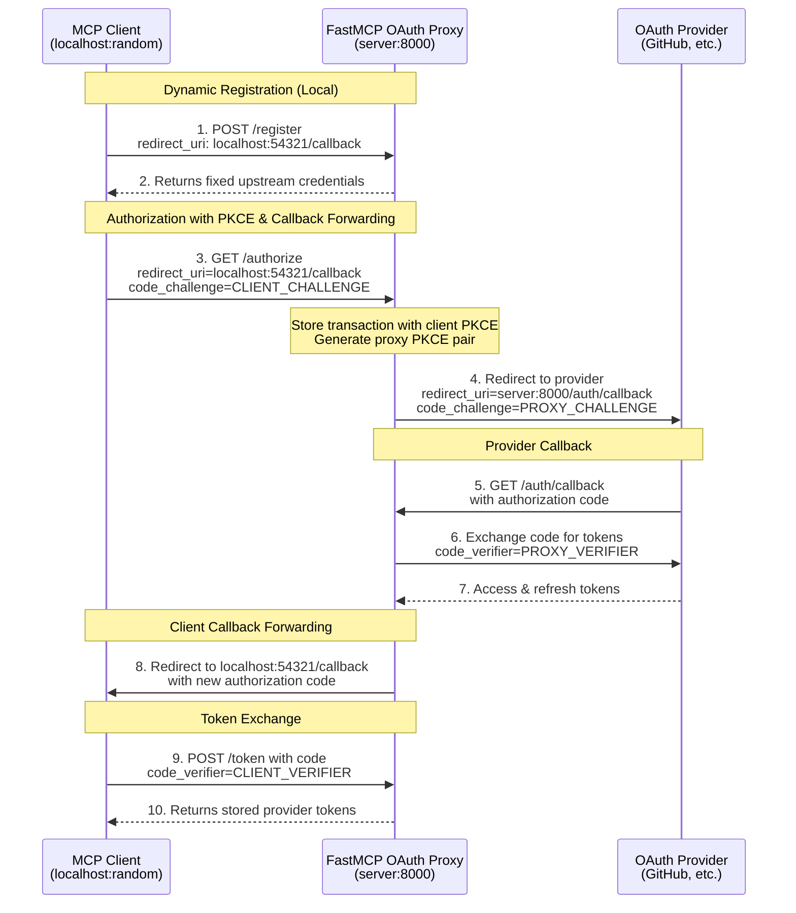

import { VersionBadge } from "/snippets/version-badge.mdx";

<VersionBadge version="2.12.0" />

OAuth Proxy enables FastMCP servers to authenticate with OAuth providers that **don't support Dynamic Client Registration (DCR)**. This includes virtually all traditional OAuth providers: GitHub, Google, Azure, Discord, Facebook, and most enterprise identity systems. For providers that do support DCR (like Descope and WorkOS AuthKit), use [`RemoteAuthProvider`](/servers/auth/remote-oauth) instead.

MCP clients expect to register automatically and obtain credentials on the fly, but traditional providers require manual app registration through their developer consoles. OAuth Proxy bridges this gap by presenting a DCR-compliant interface to MCP clients while using your pre-registered credentials with the upstream provider. When a client attempts to register, the proxy returns your fixed credentials. When a client initiates authorization, the proxy handles the complexity of callback forwarding—storing the client's dynamic callback URL, using its own fixed callback with the provider, then forwarding back to the client after token exchange.

This approach enables any MCP client (whether using random localhost ports or fixed URLs like Claude.ai) to authenticate with any traditional OAuth provider, all while maintaining full OAuth 2.1 and PKCE security.

## Implementation

### Provider Setup Requirements

Before using OAuth Proxy, you need to register your application with your OAuth provider:

1. **Register your application** in the provider's developer console (GitHub Settings, Google Cloud Console, Azure Portal, etc.)
2. **Configure the redirect URI** as your FastMCP server URL plus your chosen callback path:
   - Default: `https://your-server.com/auth/callback` 
   - Custom: `https://your-server.com/your/custom/path` (if you set `redirect_path`)
   - Development: `http://localhost:8000/auth/callback`
3. **Obtain your credentials**: Client ID and Client Secret
4. **Note the OAuth endpoints**: Authorization URL and Token URL (usually found in the provider's OAuth documentation)

<Warning>
  The redirect URI you configure with your provider must exactly match your
  FastMCP server's URL plus the callback path. If you customize `redirect_path`
  in OAuth Proxy, update your provider's redirect URI accordingly.
</Warning>

### Basic Setup

Here's how to implement OAuth Proxy with any provider:

```python
from fastmcp import FastMCP
from fastmcp.server.auth import OAuthProxy
from fastmcp.server.auth.providers.jwt import JWTVerifier

# Configure token verification for your provider
# See the Token Verification guide for provider-specific setups
token_verifier = JWTVerifier(
    jwks_uri="https://your-provider.com/.well-known/jwks.json",
    issuer="https://your-provider.com",
    audience="your-app-id"
)

# Create the OAuth proxy
auth = OAuthProxy(
    # Provider's OAuth endpoints (from their documentation)
    upstream_authorization_endpoint="https://provider.com/oauth/authorize",
    upstream_token_endpoint="https://provider.com/oauth/token",

    # Your registered app credentials
    upstream_client_id="your-client-id",
    upstream_client_secret="your-client-secret",

    # Token validation (see Token Verification guide)
    token_verifier=token_verifier,

    # Your FastMCP server's public URL
    base_url="https://your-server.com",
    
    # Optional: customize the callback path (default is "/auth/callback")
    # redirect_path="/custom/callback",
)

mcp = FastMCP(name="My Server", auth=auth)
```

### Configuration Parameters

<Card icon="code" title="OAuthProxy Parameters">
<ParamField body="upstream_authorization_endpoint" type="str" required>
  URL of your OAuth provider's authorization endpoint (e.g., `https://github.com/login/oauth/authorize`)
</ParamField>

<ParamField body="upstream_token_endpoint" type="str" required>
  URL of your OAuth provider's token endpoint (e.g., `https://github.com/login/oauth/access_token`)
</ParamField>

<ParamField body="upstream_client_id" type="str" required>
  Client ID from your registered OAuth application
</ParamField>

<ParamField body="upstream_client_secret" type="str" required>
  Client secret from your registered OAuth application
</ParamField>

<ParamField body="token_verifier" type="TokenVerifier" required>
  A [`TokenVerifier`](/servers/auth/token-verification) instance to validate the provider's tokens
</ParamField>

<ParamField body="base_url" type="AnyHttpUrl | str" required>
  Public URL of your FastMCP server (e.g., `https://your-server.com`)
</ParamField>

<ParamField body="redirect_path" type="str" default="/auth/callback">
  Path for OAuth callbacks. Must match the redirect URI configured in your OAuth application
</ParamField>

<ParamField body="upstream_revocation_endpoint" type="str | None">
  Optional URL of provider's token revocation endpoint
</ParamField>

<ParamField body="issuer_url" type="AnyHttpUrl | str | None">
  Issuer URL for OAuth metadata (defaults to base_url)
</ParamField>

<ParamField body="service_documentation_url" type="AnyHttpUrl | str | None">
  Optional URL to your service documentation
</ParamField>

<ParamField body="forward_pkce" type="bool" default="True">
  Whether to forward PKCE (Proof Key for Code Exchange) to the upstream OAuth provider. When enabled and the client uses PKCE, the proxy generates its own PKCE parameters to send upstream while separately validating the client's PKCE. This ensures end-to-end PKCE security at both layers (client-to-proxy and proxy-to-upstream).
  - `True` (default): Forward PKCE for providers that support it (Google, Azure, GitHub, etc.)
  - `False`: Disable only if upstream provider doesn't support PKCE
</ParamField>

<ParamField body="token_endpoint_auth_method" type="str | None">
  Token endpoint authentication method for the upstream OAuth server. Controls how the proxy authenticates when exchanging authorization codes and refresh tokens with the upstream provider.
  - `"client_secret_basic"`: Send credentials in Authorization header (most common)
  - `"client_secret_post"`: Send credentials in request body (required by some providers)
  - `"none"`: No authentication (for public clients)
  - `None` (default): Uses authlib's default (typically `"client_secret_basic"`)
  
  Set this if your provider requires a specific authentication method and the default doesn't work.
</ParamField>

<ParamField body="allowed_client_redirect_uris" type="list[str] | None">
  List of allowed redirect URI patterns for MCP clients. Patterns support wildcards (e.g., `"http://localhost:*"`, `"https://*.example.com/*"`).
  - `None` (default): All redirect URIs allowed (for MCP/DCR compatibility)
  - Empty list `[]`: No redirect URIs allowed
  - Custom list: Only matching patterns allowed
  
  These patterns apply to MCP client loopback redirects, NOT the upstream OAuth app redirect URI.
</ParamField>

<ParamField body="valid_scopes" type="list[str] | None">
  List of all possible valid scopes for the OAuth provider. These are advertised to clients through the `/.well-known` endpoints. Defaults to `required_scopes` from your TokenVerifier if not specified.
</ParamField>

<ParamField body="extra_authorize_params" type="dict[str, str] | None">
  Additional parameters to forward to the upstream authorization endpoint. Useful for provider-specific parameters that aren't part of the standard OAuth2 flow.
  
  For example, Auth0 requires an `audience` parameter to issue JWT tokens:
  ```python
  extra_authorize_params={"audience": "https://api.example.com"}
  ```
  
  These parameters are added to every authorization request sent to the upstream provider.
</ParamField>

<ParamField body="extra_token_params" type="dict[str, str] | None">
  Additional parameters to forward to the upstream token endpoint during code exchange and token refresh. Useful for provider-specific requirements during token operations.
  
  For example, some providers require additional context during token exchange:
  ```python
  extra_token_params={"audience": "https://api.example.com"}
  ```
  
  These parameters are included in all token requests to the upstream provider.
</ParamField>
</Card>

### Provider-Specific Parameters

Some OAuth providers require additional parameters beyond the standard OAuth2 flow. Use `extra_authorize_params` and `extra_token_params` to handle these requirements:

#### Auth0 Example

Auth0 requires an `audience` parameter to issue JWT tokens instead of opaque tokens:

```python
auth = OAuthProxy(
    upstream_authorization_endpoint="https://your-domain.auth0.com/authorize",
    upstream_token_endpoint="https://your-domain.auth0.com/oauth/token",
    upstream_client_id="your-auth0-client-id",
    upstream_client_secret="your-auth0-client-secret",
    
    # Auth0 requires audience for JWT tokens
    extra_authorize_params={
        "audience": "https://your-api-identifier.com"
    },
    extra_token_params={
        "audience": "https://your-api-identifier.com"  
    },
    
    token_verifier=JWTVerifier(
        jwks_uri="https://your-domain.auth0.com/.well-known/jwks.json",
        issuer="https://your-domain.auth0.com/",
        audience="https://your-api-identifier.com"
    ),
    
    base_url="https://your-server.com"
)
```

#### RFC 8707 Resource Indicators

MCP clients can specify target resources using the standard `resource` parameter (RFC 8707). This is automatically forwarded when present:

```python
# Client code (automatic - no server configuration needed)
# The resource parameter is passed through from AuthorizationParams
```

### Using Built-in Providers

FastMCP includes pre-configured providers for common services:

```python
from fastmcp.server.auth.providers.github import GitHubProvider

auth = GitHubProvider(
    client_id="your-github-app-id",
    client_secret="your-github-app-secret",
    base_url="https://your-server.com"
)

mcp = FastMCP(name="My Server", auth=auth)
```

Available providers include `GitHubProvider`, `GoogleProvider`, and others. These handle token verification automatically.

### Scope Configuration

OAuth scopes are configured through your `TokenVerifier`. Set `required_scopes` to automatically request the permissions your application needs:

```python
JWTVerifier(..., required_scopes = ["read:user", "write:data"])
```

Dynamic clients created by the proxy will automatically include these scopes in their authorization requests.

## How It Works



The flow diagram above illustrates the complete OAuth Proxy pattern. Let's understand each phase:

### Registration Phase

When an MCP client calls `/register` with its dynamic callback URL, the proxy responds with your pre-configured upstream credentials. The client stores these credentials believing it has registered a new app. Meanwhile, the proxy records the client's callback URL for later use.

### Authorization Phase

The client initiates OAuth by redirecting to the proxy's `/authorize` endpoint. The proxy:

1. Stores the client's transaction with its PKCE challenge
2. Generates its own PKCE parameters for upstream security
3. Redirects to the upstream provider using the fixed callback URL

This dual-PKCE approach maintains end-to-end security at both the client-to-proxy and proxy-to-provider layers.

### Callback Phase

After user authorization, the provider redirects back to the proxy's fixed callback URL. The proxy:

1. Exchanges the authorization code for tokens with the provider
2. Stores these tokens temporarily
3. Generates a new authorization code for the client
4. Redirects to the client's original dynamic callback URL

### Token Exchange Phase

Finally, the client exchanges its authorization code with the proxy to receive the provider's tokens. The proxy validates the client's PKCE verifier before returning the stored tokens.

This entire flow is transparent to the MCP client—it experiences a standard OAuth flow with dynamic registration, unaware that a proxy is managing the complexity behind the scenes.

### PKCE Forwarding

OAuth Proxy automatically handles PKCE (Proof Key for Code Exchange) when working with providers that support or require it. The proxy generates its own PKCE parameters to send upstream while separately validating the client's PKCE, ensuring end-to-end security at both layers.

This is enabled by default via the `forward_pkce` parameter and works seamlessly with providers like Google, Azure AD, and GitHub. Only disable it for legacy providers that don't support PKCE:

```python
# Disable PKCE forwarding only if upstream doesn't support it
auth = OAuthProxy(
    ...,
    forward_pkce=False  # Default is True
)
```

### Redirect URI Validation

While OAuth Proxy accepts all redirect URIs by default (for DCR compatibility), you can restrict which clients can connect by specifying allowed patterns:

```python
# Allow only localhost clients (common for development)
auth = OAuthProxy(
    # ... other parameters ...
    allowed_client_redirect_uris=[
        "http://localhost:*",
        "http://127.0.0.1:*"
    ]
)

# Allow specific known clients
auth = OAuthProxy(
    # ... other parameters ...
    allowed_client_redirect_uris=[
        "http://localhost:*",
        "https://claude.ai/api/mcp/auth_callback",
        "https://*.mycompany.com/auth/*"  # Wildcard patterns supported
    ]
)
```

Check your server logs for "Client registered with redirect_uri" messages to identify what URLs your clients use.

## Token Verification

OAuth Proxy requires a compatible `TokenVerifier` to validate tokens from your provider. Different providers use different token formats:

- **JWT tokens** (Google, Azure): Use `JWTVerifier` with the provider's JWKS endpoint
- **Opaque tokens** (GitHub, Discord): Use provider-specific verifiers or implement custom validation

See the [Token Verification guide](/servers/auth/token-verification) for detailed setup instructions for your provider.

## Environment Configuration

<VersionBadge version="2.12.1" />

For production deployments, configure OAuth Proxy through environment variables instead of hardcoding credentials:

```bash
# Specify the provider implementation
export FASTMCP_SERVER_AUTH=fastmcp.server.auth.providers.github.GitHubProvider

# Provider-specific credentials
export FASTMCP_SERVER_AUTH_GITHUB_CLIENT_ID="Ov23li..."
export FASTMCP_SERVER_AUTH_GITHUB_CLIENT_SECRET="abc123..."
export FASTMCP_SERVER_AUTH_GITHUB_BASE_URL="https://your-production-server.com"
```

With environment configuration, your server code simplifies to:

```python
from fastmcp import FastMCP

# Authentication automatically configured from environment
mcp = FastMCP(name="My Server")

@mcp.tool
def protected_tool(data: str) -> str:
    """This tool is now protected by OAuth."""
    return f"Processed: {data}"

if __name__ == "__main__":
    mcp.run(transport="http", port=8000)
```
